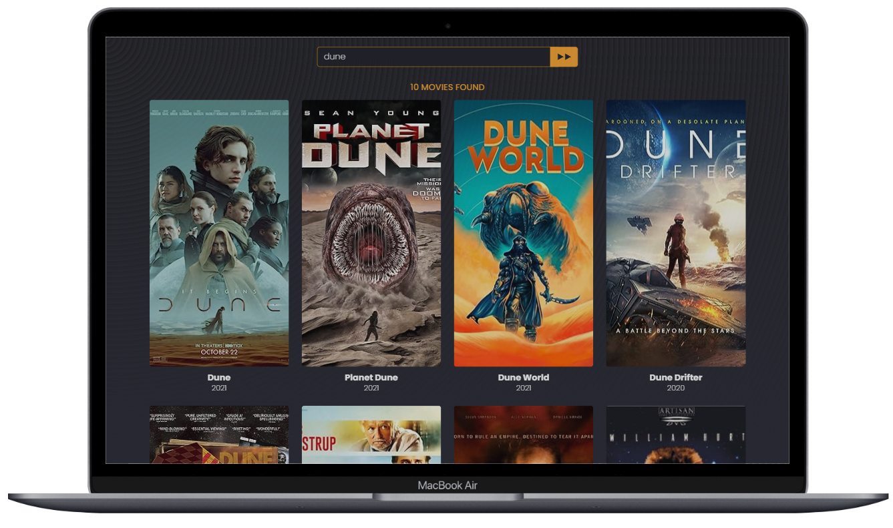
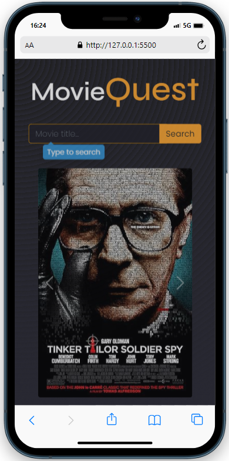

# MovieQuest App

Welcome to MovieQuest App! This application enables users to search for movies and explore detailed information about each selection. Users can easily view movie posters and access additional details for each movie.

## Screenshots

  
  

## Access the App

You can access the app using the following link: [Movie Search App](#)

## Technologies Used

- HTML
- CSS
- Bootstrap 5.0.2
- JavaScript

## API Used

This app utilizes the OMDb API to fetch movie data. The OMDb API is a RESTful web service to obtain movie information, including posters, plot, ratings, and more.
https://www.omdbapi.com

## Usage

To use the app, follow these steps:

1. Type the name of the movie you want to search for in the input field.
2. Click the "Search" button or press the Enter key to initiate the search.
3. The app will display the search results, and you can click on any movie to view more details.
4. To close the modal with the movie details, click the "X" button or press the Escape key.

## Features

- Displays a carousel with random movies on the first load.
- Enables users to search for movies by their titles.
- Displays movie posters and additional information about the selected movie.
- Provides a user-friendly interface with smooth animations and responsive design.
